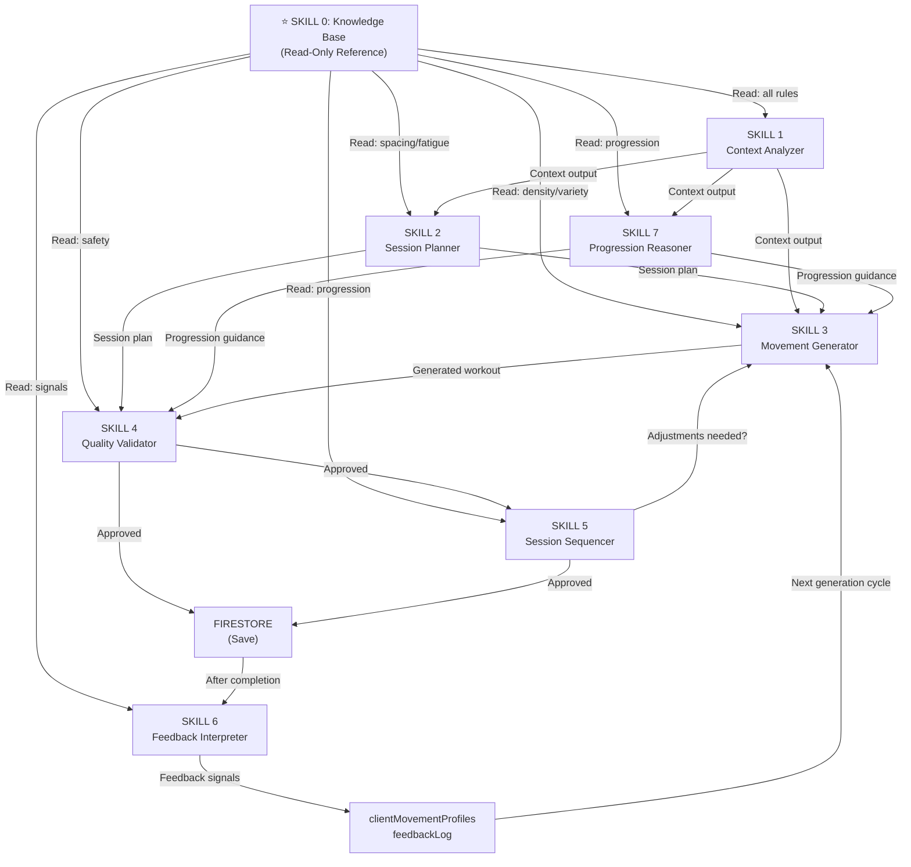
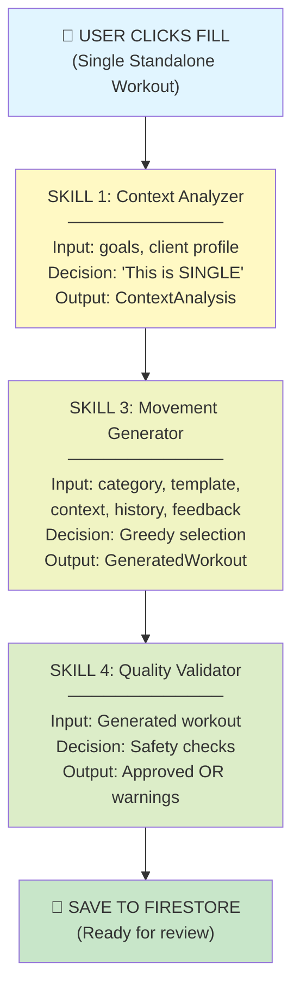
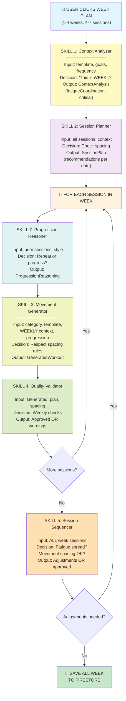
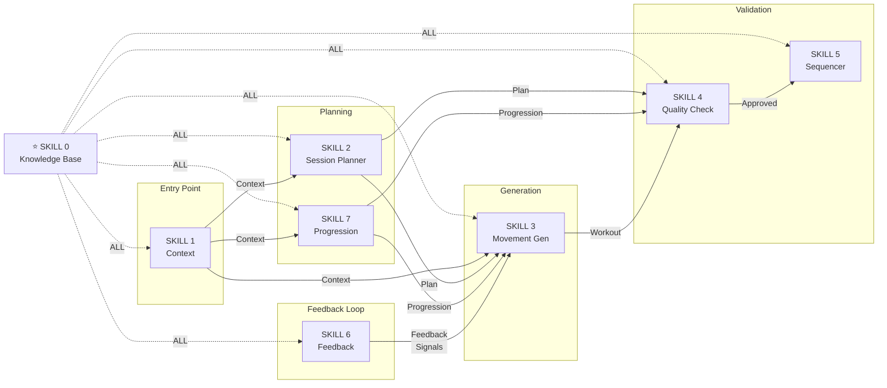

# Skill Architecture Flow Diagrams

Visual representations of the skill-based workout generation system across all three time horizons.

---

## Mermaid Diagram: Complete System Overview



---

## Mermaid Diagram: SINGLE Workout Flow



---

## Mermaid Diagram: WEEKLY Planning Flow



---

## Mermaid Diagram: MONTHLY Planning Flow

```mermaid
graph TD
    START["📆 USER CLICKS MONTH PLAN<br/>(4 weeks, 12-16 sessions,<br/>progressive structure)"]
    
    START --> CA["SKILL 1: Context Analyzer<br/>─────────────<br/>Input: goals, split, frequency<br/>Decision: 'This is MONTHLY'<br/>Output: ContextAnalysis<br/>{progressive: true}"]
    
    CA --> SP["SKILL 2: Session Planner<br/>─────────────<br/>Input: 4 weeks of sessions<br/>Decision: Build phases<br/>Output: SessionPlan<br/>{Week1:base, Week2:build,<br/>Week3:peak, Week4:deload}"]
    
    SP --> WEEKLOOP["🔄 FOR EACH WEEK (1-4)"]
    
    WEEKLOOP --> WEEKPR["SKILL 7: Progression Reasoner<br/>(WEEK-LEVEL)<br/>─────────────<br/>Input: last month, week phase<br/>Decision: Progression trajectory<br/>Output: LoadAdjustment,<br/>VolumeAdjustment"]
    
    WEEKPR --> DAYLOOP["🔄 FOR EACH SESSION IN WEEK"]
    
    DAYLOOP --> DAYPR["SKILL 7: Progression Reasoner<br/>(SESSION-LEVEL)<br/>─────────────<br/>Input: last 1-2 sessions<br/>Decision: Daily progression<br/>Output: ProgressionReasoning"]
    
    DAYPR --> MG["SKILL 3: Movement Generator<br/>─────────────<br/>Input: category, template,<br/>MONTHLY context, week phase,<br/>session progression<br/>Decision: Respect progression arc<br/>Output: GeneratedWorkout"]
    
    MG --> QV["SKILL 4: Quality Validator<br/>─────────────<br/>Input: Generated, plans,<br/>progression guidance<br/>Decision: All checks<br/>Output: Approved OR warnings"]
    
    QV --> DAYEND{More sessions<br/>in week?}
    DAYEND -->|Yes| DAYLOOP
    DAYEND -->|No| WEEKEND{More weeks?}
    WEEKEND -->|Yes| WEEKLOOP
    WEEKEND -->|No| SS["SKILL 5: Session Sequencer<br/>(CROSS-WEEK)<br/>─────────────<br/>Input: ALL 4 weeks<br/>Decision: Progression trajectory?<br/>Fatigue spread?<br/>Output: Adjustments OR approved"]
    
    SS --> ADJUST{Adjustments needed?}
    ADJUST -->|Yes| WEEKLOOP
    ADJUST -->|No| SAVE["💾 SAVE ALL MONTH<br/>TO FIRESTORE"]
    
    style START fill:#e1f5ff
    style SAVE fill:#c8e6c9
    style WEEKLOOP fill:#f3e5f5
    style DAYLOOP fill:#fff3e0
    style CA fill:#fff9c4
    style SP fill:#f3e5f5
    style WEEKPR fill:#e0f2f1
    style DAYPR fill:#e0f2f1
    style MG fill:#f0f4c3
    style QV fill:#dcedc8
    style SS fill:#ffe0b2
```



---

## Mermaid Diagram: Skill Dependency Graph



---

## ASCII Flow: SINGLE Workout (Simplified)

```
┌─────────────────────────────────────────┐
│ USER CLICKS "FILL"                      │
│ (Single, standalone workout)            │
└────────────────┬────────────────────────┘
                 │
    ┌────────────▼──────────────┐
    │ SKILL 1: Context          │
    │ "This is SINGLE"          │
    └────────────┬──────────────┘
                 │
    ┌────────────▼──────────────────────┐
    │ SKILL 3: Movement Generator       │
    │ "Greedy selection for this only"  │
    │ → Pick best movements             │
    └────────────┬──────────────────────┘
                 │
    ┌────────────▼──────────────────────┐
    │ SKILL 4: Quality Validator        │
    │ "Check: No pain blocks?"          │
    │ "Check: Density OK?"              │
    └────────────┬──────────────────────┘
                 │
    ┌────────────▼──────────────────────┐
    │ 💾 SAVE TO FIRESTORE              │
    │ Ready for coach review             │
    └──────────────────────────────────┘
```

---

## ASCII Flow: WEEKLY Planning (Simplified)

```
┌──────────────────────────────────────────┐
│ USER CLICKS "WEEK PLAN + FILL"           │
│ (1-4 weeks, need coordination)           │
└────────────┬───────────────────────────┬─┘
             │                           │
    ┌────────▼──────────┐     ┌──────────▼──────┐
    │ SKILL 1: Context  │     │ SKILL 2: Plan   │
    │ "This is WEEKLY"  │     │ Sessions check  │
    └────────┬──────────┘     └──────────┬──────┘
             │                           │
             └───────────────┬───────────┘
                             │
              ┌──────────────▼───────────────┐
              │ FOR EACH SESSION:            │
              │  • Skill 7: Progression     │
              │  • Skill 3: Generate        │
              │  • Skill 4: Validate        │
              └──────────────┬───────────────┘
                             │
              ┌──────────────▼─────────────┐
              │ SKILL 5: Sequencer         │
              │ Check full week:           │
              │ • Fatigue spread?          │
              │ • Spacing rules OK?        │
              │ • Any adjustments?         │
              └──────────────┬─────────────┘
                             │
              ┌──────────────▼─────────────┐
              │ 💾 SAVE ALL WEEK           │
              │ Ready for coach review     │
              └────────────────────────────┘
```

---

## ASCII Flow: MONTHLY Planning (Simplified)

```
┌─────────────────────────────────────────────┐
│ USER CLICKS "MONTH PLAN + FILL"             │
│ (4 weeks, progressive structure)            │
└────────────┬──────────────────────────────┬─┘
             │                              │
    ┌────────▼──────────────┐    ┌──────────▼────────────┐
    │ SKILL 1: Context      │    │ SKILL 2: Session Plan │
    │ "This is MONTHLY"     │    │ Week phases:          │
    │ "Progressive: true"   │    │ • W1: Base            │
    └────────┬──────────────┘    │ • W2: Build           │
             │                   │ • W3: Peak            │
             └──────────┬────────┤ • W4: Deload          │
                        │        └──────────┬────────────┘
                        │                   │
                        └───────────────────┼───────┐
                                            │       │
                        ┌───────────────────▼─┐     │
                        │ FOR EACH WEEK:      │     │
                        │ • Skill 7 (week)    │     │
                        │ • FOR EACH SESSION: │     │
                        │   • Skill 7 (day)   │     │
                        │   • Skill 3 (gen)   │     │
                        │   • Skill 4 (val)   │     │
                        └───────────────┬─────┘     │
                                        │           │
                        ┌───────────────▼───────┐   │
                        │ SKILL 5: Sequencer    │   │
                        │ Check cross-week:     │◄──┘
                        │ • Progression arc?    │
                        │ • Fatigue OK?         │
                        │ • Adjustments?        │
                        └───────────────┬───────┘
                                        │
                        ┌───────────────▼───────┐
                        │ 💾 SAVE ALL MONTH     │
                        │ Ready for coach review │
                        └───────────────────────┘
```

---

## Decision Tree: Which Skills Run?

```
                     START: User clicks Fill
                            │
                ┌─────���─────┴───────────┐
                │                       │
         Single workout?          Multi-session block?
           (1 session)              (week/month)
                │                       │
                │                  ┌────┴────┐
                │                  │          │
              [1,3,4]          Weekly?    Monthly?
                                 │          │
                               [1,2,     [1,2,
                                3,4,     3,4,
                                5,7]     5,7]

KEY:
[1,3,4] = Context Analyzer → Movement Generator → Quality Validator
[1,2,3,4,5,7] = Add Session Planner, Session Sequencer, Progression Reasoner
Progression Reasoner (7) = Runs ONCE per week session, TWICE per month session

All: Read SKILL 0 (Knowledge Base)
All: Can trigger SKILL 6 (Feedback) async after completion
```

---

## Time Complexity by Horizon

```
SINGLE:
  Skills: 3 (CA → MG → QV)
  Time: O(1) - no loops
  
WEEKLY (5 sessions):
  Skills: ~7
  Time: O(n) where n = sessions per week
    For each session: Skill 7 + Skill 3 + Skill 4
    + Final: Skill 5 (once)
  Typical: 3-4 loops
  
MONTHLY (16 sessions):
  Skills: ~7
  Time: O(n × m) where n = weeks, m = sessions per week
    For each week:
      Skill 7 (week level)
      For each session:
        Skill 7 (session level) + Skill 3 + Skill 4
    + Final: Skill 5 (once)
  Typical: 4 × 4 = 16 loops
  + potential re-runs if Skill 5 recommends adjustments

Memory:
  Single: Small (1 workout)
  Weekly: Medium (5 workouts in context)
  Monthly: Large (16 workouts, 4-week history)
```

---

## Feedback Loop Integration (All Flows)

```
                    WORKOUT LOGGED
                           │
                    ┌──────▼───────┐
                    │ SKILL 6:     │
                    │ Feedback     │
                    │ Interpreter  │
                    └──────┬───────┘
                           │
            ┌──────────────┴──────────────┐
            │                             │
      Movement-level                 Session-level
      (pain, too_easy, etc.)         (overrun, quality)
            │                             │
      ┌─────▼─────┐                 ┌────▼──────┐
      │ Block use │                 │ Reduce    │
      │ Suggest   │                 │ movements │
      │ alternative                 │ next time │
      └─────┬─────┘                 └────┬──────┘
            │                             │
            └──────────────┬──────────────┘
                           │
          Update clientMovementProfiles
                           │
          ┌────────────────┴────────────────┐
          │ NEXT GENERATION CYCLE:          │
          │ • SKILL 3 reads feedback       │
          │   (skip blocked movements)     │
          │ • SKILL 7 reads feedback       │
          │   (adjust progression)         │
          │ • SKILL 4 checks feedback      │
          │   (safety gates)               │
          └─────────────────────────────────┘
```

---

## Skill Call Sequence: Monthly Example

```
Timeline for one month generation:

T0:  User clicks "Month Plan + Fill"
T1:  SKILL 1 (Context Analyzer)
     → Output: Strength goal, monthly, 4 weeks
     
T2:  SKILL 2 (Session Planner)
     → Output: 4-week phases (base, build, peak, deload)
     
T3:  LOOP Week 1:
  T3a:  SKILL 7 (Progression, week-level)
        → "This is week 1 base"
  T3b:  LOOP Session 1 (Mon):
    T3b-i:   SKILL 7 (Progression, session-level)
             → "First session, establish pattern"
    T3b-ii:  SKILL 3 (Movement Generator)
             → 5x back squat, RDL, etc.
    T3b-iii: SKILL 4 (Quality Validator)
             → ✓ Approved
  T3c:  LOOP Session 2 (Wed):
    T3c-i:   SKILL 7 (Progression, session-level)
             → "Wed upper, avoid Mon leg conflict"
    T3c-ii:  SKILL 3 (Movement Generator)
             → Bench, rows, etc.
    T3c-iii: SKILL 4 (Quality Validator)
             → ✓ Approved
  ... (repeat for Thu, Fri in Week 1)
  
T4:  LOOP Week 2:
  T4a:  SKILL 7 (Progression, week-level)
        → "Build week, increase volume +20%"
  T4b:  LOOP each session in Week 2
        → Skill 7 (session), Skill 3, Skill 4
  ... (repeat for Weeks 3-4)
  
T5:  SKILL 5 (Session Sequencer)
     → Check all 16 sessions across 4 weeks
     → Verify progression trajectory
     → Verify fatigue spreading
     → Output: ✓ Approved or [adjustments]
     
T6:  Save all 16 sessions to Firestore
```

---

## Summary: Skill Invocation Matrix

|Horizon|CA|SP|MG|QV|SS|PR|FI|Total Skills|
|-------|--|--|--|--|--|--|--|------------|
|Single |✓ | |✓ |✓ | | | |3           |
|Weekly |✓ |✓ |✓ |✓ |✓ |✓ | |6           |
|Monthly|✓ |✓ |✓ |✓ |✓ |✓ | |6           |
|Feedback(async)||||||| |✓ |1           |

**Skill Definitions:**
- CA = Context Analyzer
- SP = Session Planner
- MG = Movement Generator
- QV = Quality Validator
- SS = Session Sequencer
- PR = Progression Reasoner
- FI = Feedback Interpreter

